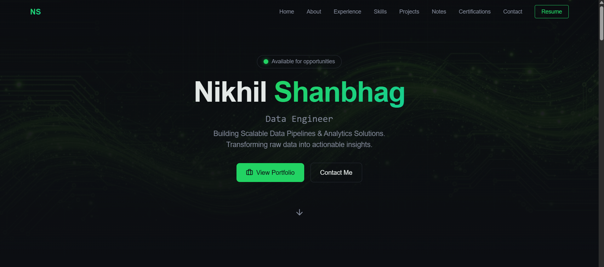

# 🌐 Nikhil Shanbhag – Data Engineer Portfolio

Welcome to my personal portfolio website repository.  
This website showcases my **data engineering projects, technical skills and certifications**.

---

## 🚀 About Me

I am a **Data Engineer with 3+ years of experience** working with Azure Data Factory, Databricks, SQL, Python, and Oracle FDI.  
I enjoy building scalable data pipelines, optimizing analytics workflows, and exploring cloud data platforms.  

This portfolio serves as a central hub for:
- My technical projects
- Professional experience
<!-- - Learning notes and blogs -->
- Certifications and achievements

---

## 🧰 Tech Stack

### **Frontend**
- HTML5, CSS3, JavaScript  
- React.js  
- Tailwind CSS / Custom CSS  
- Framer Motion (animations)

### **Data Engineering**
- Python, SQL  
- Apache Spark (PySpark)  
- Azure Data Factory  
- Azure Databricks  
- Oracle FDI  
- Control-M 

---

## 📂 Website Sections

### 🧑‍💻 1. About Me  
Professional background, experience, and interests.

### 📚 2. Technical Skills
All of my technical skills

### 📊 3. Projects  
Detailed data engineering projects

<!-- ### 📚 3. Data Engineering Notes  
Curated notes and explanations on:
- SQL concepts  
- Spark & distributed computing    -->

### 🎓 4. Certifications  
List of certifications, learning paths, and achievements.

### 📩 5. Contact  
Links to LinkedIn, GitHub, and email for collaboration and opportunities.

---

## 📸 Preview



---

## ⚙️ Getting Started

### Clone the repository

```bash
git clone https://github.com/Nikhil-1503/portfolio-website.git
cd portfolio-website
